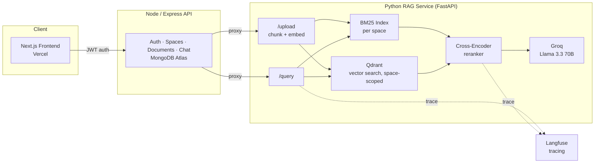

# DocMind

A production-style Retrieval-Augmented Generation (RAG) platform with hybrid search, cross-encoder reranking, automated quality evaluation, and full observability — wrapped in a multi-tenant, full-stack web app.

**Live demo:** [https://doc-mind-pearl.vercel.app](https://doc-mind-pearl.vercel.app)

---

## What it does

DocMind lets a user create isolated **Spaces**, upload documents into a Space, and ask natural-language questions that get answered strictly from that Space's documents — with source citations and no cross-tenant data leakage.

Under the hood it's not a single LLM call over one big vector index. Each query runs through a retrieval pipeline built the way production search/RAG systems are actually structured:

1. **Hybrid retrieval** — BM25 (keyword/lexical) and dense vector search run in parallel and are merged, so both exact-term matches and semantic matches surface.
2. **Cross-encoder reranking** — the merged candidate set is re-scored by a cross-encoder that jointly attends to the query and each candidate chunk, which is more accurate than similarity search alone but too expensive to run over the full corpus — hence retrieve-then-rerank instead of rerank-everything.
3. **Grounded generation** — the top reranked chunks are passed to an LLM with a prompt that forbids outside knowledge and requires the model to say "I don't have enough information" rather than guess.
4. **Evaluation & tracing** — every change to retrieval/reranking/prompting can be checked against a held-out question set with Ragas (faithfulness, answer relevancy), and every live request is traced end-to-end in Langfuse.

---

## Architecture



**Deployment topology:** frontend on Vercel, Node API on Render, Python RAG service on Hugging Face Spaces (Docker) — split out because the embedding + cross-encoder models need more memory than a typical free-tier web dyno provides.

---

## Key features

**Multi-tenant Spaces** — every document, embedding, and chat message is scoped to a `space_id` end-to-end: Qdrant payload filtering on ingestion and retrieval, MongoDB queries scoped by both resource ID and `userId` to prevent IDOR, and a separate BM25 index built per space. One user's documents are never visible to another user, and one Space's content never leaks into another Space's answers.

**Hybrid search** — BM25Okapi (rank-bm25) for lexical matching, `all-MiniLM-L6-v2` sentence embeddings + Qdrant cosine similarity for semantic matching, merged by result key with a `matched_by` tag so it's possible to see whether a chunk surfaced from vector search, BM25, or both.

**Cross-encoder reranking** — `cross-encoder/ms-marco-MiniLM-L-6-v2` rescoring the union of hybrid candidates before the top 5 are sent to generation.

**Hallucination-resistant generation** — the prompt explicitly restricts the model to the provided context and requires an "I don't have enough information" fallback instead of guessing. Verified in eval (see below): an out-of-scope question ("What is the capital of France?") was correctly refused rather than answered from the model's own knowledge.

**Automated evaluation** — Ragas faithfulness and answer-relevancy scoring against a fixed question set, run via LangChain wrappers around Groq for the judge LLM and HuggingFace embeddings for similarity scoring.

**Observability** — Langfuse `@observe()` tracing on the retrieval, rerank, and generation steps, giving per-request latency and call graphs without custom instrumentation code.

**Graceful degradation** — upstream rate limits (Groq) are caught and surfaced as `503 Service Unavailable` with a clear message, instead of leaking a raw `500` to the client.

---

## Evaluation results

Ragas scores from a 12-question held-out set spanning three source documents (mixed topics, to test that retrieval doesn't cross-contaminate) plus one deliberately out-of-scope question:

| Metric | Avg (11 in-domain questions) | Notes |
|---|---|---|
| Faithfulness | **0.98** | Is the answer actually supported by the retrieved context? |
| Answer Relevancy | **0.87** | Does the answer address what was actually asked? |

The 12th question ("What is the capital of France?" — answerable from general knowledge but absent from the corpus) correctly triggered the "I don't have enough information" refusal. Ragas scores this 0 on both metrics since there's no supporting context to measure against, which is the expected and desired behavior for an out-of-scope query, not a system failure.

Full results: [`rag-service/eval/eval_results.csv`](rag-service/eval/eval_results.csv)

---

## Tech stack

| Layer | Technology |
|---|---|
| Frontend | Next.js 16 (App Router), React 19, Tailwind CSS 4 |
| Backend API | Node.js, Express 5, MongoDB Atlas (Mongoose), JWT auth, bcrypt |
| RAG Service | Python, FastAPI, Uvicorn |
| Retrieval | Qdrant Cloud (vector), rank-bm25 (lexical) |
| Embeddings / Reranking | sentence-transformers (`all-MiniLM-L6-v2`, `cross-encoder/ms-marco-MiniLM-L-6-v2`) |
| Generation | Groq (`llama-3.3-70b-versatile`) |
| Evaluation | Ragas, LangChain |
| Observability | Langfuse |
| Deployment | Vercel (frontend), Render (API), Hugging Face Spaces / Docker (RAG service) |

---

## API surface

**RAG service (FastAPI)**
- `POST /upload` — accepts a file + `space_id`, extracts text, chunks it, embeds and stores it, rebuilds the space's BM25 index.
- `GET /query?q=...&space_id=...` — runs hybrid search → rerank → generation, returns the answer plus before/after-rerank chunk metadata.

**Backend API (Express)**
- `POST /api/auth/register`, `POST /api/auth/login`
- `POST /api/spaces`, `GET /api/spaces` — space CRUD, scoped to the authenticated user
- `POST /api/documents/upload` — proxies to the RAG service's `/upload`
- `POST /api/chat/query`, `GET /api/chat/history` — proxies to `/query`, persists Q&A pairs to MongoDB

---

## Design decisions worth calling out

- **Retrieve-then-rerank, not rerank-everything.** Cross-encoders score a query against every candidate jointly, which is far more accurate than cosine similarity but doesn't scale to a whole corpus. Hybrid search first narrows the field to ~20-40 candidates, and only those get reranked.
- **BM25 index per Space, rebuilt on upload.** Since BM25 needs the full corpus statistics (term frequencies, document frequencies) to score correctly, it's rebuilt whenever a Space's documents change, rather than incrementally updated.
- **Qdrant payload filtering for tenancy, not separate collections.** All Spaces share one Qdrant collection with a `space_id` payload field and a required index on it — simpler to operate than provisioning a collection per tenant, while still hard-scoping every query.
- **CPU-only PyTorch build for deployment.** The default PyTorch wheel bundles ~2GB of CUDA binaries that are useless on a CPU-only host. Pinning the CPU-only wheel index cut the deploy image down significantly without changing model behavior.
- **RAG service deployed separately from the API**, on Hugging Face Spaces rather than the same host as the Node API, because the embedding and reranking models need more RAM than a typical free-tier web dyno provides.

---

## Local setup

```bash
# RAG service
cd rag-service
python3 -m venv venv && source venv/bin/activate
pip install -r requirements.txt
uvicorn app.main:app --reload

# Backend API
cd backend
npm install
node index.js

# Frontend
cd frontend
npm install
npm run dev
```

Each service needs its own `.env` — RAG service: `QDRANT_URL`, `QDRANT_API_KEY`, `GROQ_API_KEY`, `LANGFUSE_PUBLIC_KEY`, `LANGFUSE_SECRET_KEY`, `LANGFUSE_BASE_URL`. Backend: `MONGO_URL`, `JWT_SECRET`, `RAG_SERVICE_URL`.

---

## Roadmap

- CI regression gate — run the Ragas eval suite on every PR and fail the build if faithfulness/relevancy regresses past a threshold
- Cost-per-request tracking (token usage × Groq pricing) alongside the existing latency metrics
- Streaming responses instead of a single blocking `/query` call
- Incremental indexing instead of full BM25 rebuild per upload
